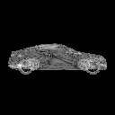
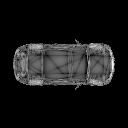
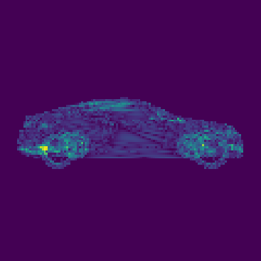

# Differentiable mesh renderer [Tensorflow]
Rastering algorithm to approximate the rendering of a 3D model silhouette in a fully differentiable way.

**:arrow_right: PyTorch implementation now available in the [`pytorch branch`](https://github.com/ndrplz/tensorflow-mesh-renderer/tree/pytorch)!**

---

This code accompanies the **[paper](https://iris.unimore.it/retrieve/handle/11380/1167726/205862/palazzi_eccvw.pdf)**:
> "End-to-end 6-DoF Object Pose Estimation through Differentiable Rasterization"

> Andrea Palazzi, Luca Bergamini, Simone Calderara, Rita Cucchiara

to appear in "*Second Workshop on 3D Reconstruction Meets Semantics (3DRMS)*" at ECCVW 2018.


<table style="width:100%">
    <tr>
        <th>
            <p align="center">
            
            <br>Rendering while rotating the camera around Y axis.
            </p>
        </th>
        <th>
            <p align="center">
            
            <br>Rendering while rotating the camera around Z axis.
            </p>
        </th>
     </tr>
 </table>

---

## Docs

#### Input meshes
The input meshes are expected to be `np.ndarray` of shape (n_triangles, 3, 3). Each mesh can be composed of a variable number of triangles. Five meshes of car 3D models are already in [data/](./data/) directory to test the Rasterer.

#### Hello World
A short snippet to test the Rasterer is available in [`main.py`](./main.py). Just run it.

Three 3D models are randomly sampled from the dummy dataset and rendered in a batch. In this snippet the position of the camera is kept fixed for all three (but it may be changed).

If everything went fine, you should see the rendering output for the 3D models sampled. Something like this:

<p align="center">
 
 <br>Output with resolution=(128, 128)
</p>

#### Moving the camera in the 3D world

There is a class [`RotoTranslation`](./rastering/rototranslation.py) which encapsulates the camera matrix, providing an easy way to change the camera location while always mantaining a geometrically consistent pose.

The initial camera pose is set as:
```
camera_pose = RotoTranslation(rotation=Vector(x=90., y=0., z=0.),
                              translation=Vector(x=0., y=-8., z=0.),
                              angle_unit='degrees')
```
To change its position, simply use its setters:
* `alpha_x`, `alpha_y`, `alpha_z` to change the rotation angle around respective axes
* `t_x`, `t_y`, `t_z` to change the translation along respective axes


